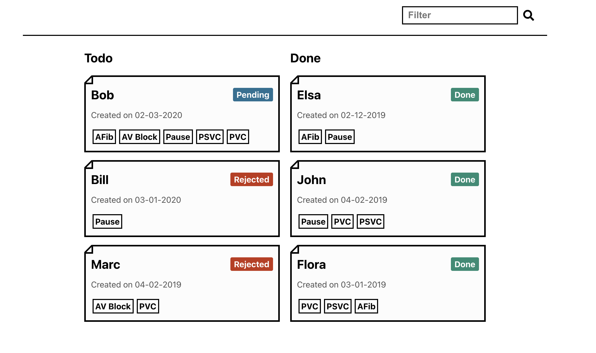

# Cardiologs Homework

## Little extras
- Patient status is persisted in the localStorage
- 2 Unit tests
- API responses are validated against an expected json schema

## Remarks
- To change the status of a patient, click on the current status of any card (only works with devices using a pointer)